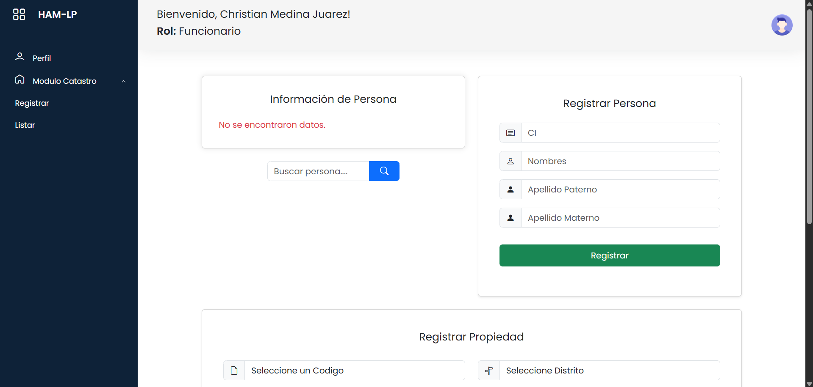
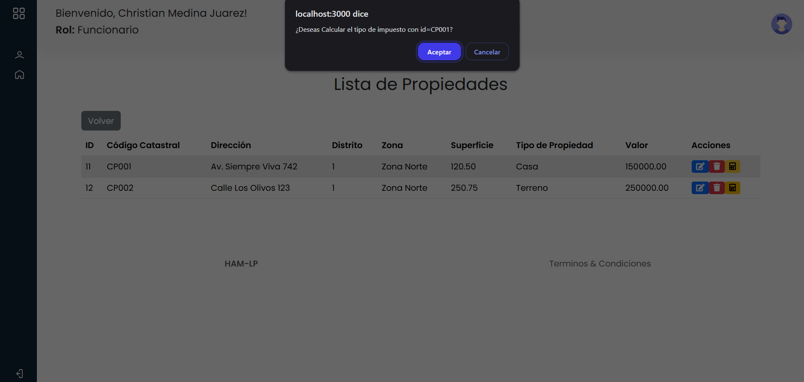
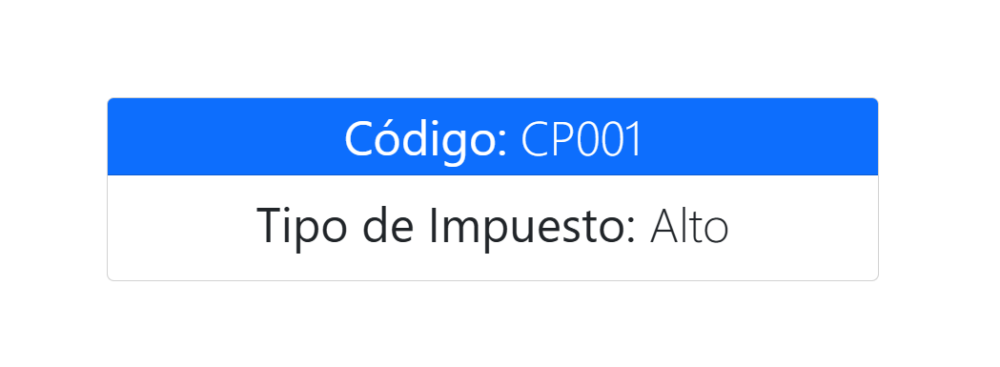

## PROYECTOS

### Proyecto 1: Creación de una Página Web Responsiva con PHP para Trámites

---
Desarrollo de una página web sencilla y responsiva utilizando PHP para la gestión y consulta de trámites fiscales, con secciones sobre impuestos, catastro y territorio, y recursos para negocios y comercio relacionados con la gestión fiscal.

#### Pasos para ejecutar el proyecto:

1. Instala **XAMPP** si aún no lo tienes.
2. Inicia los módulos **Apache**
3. Copia la carpeta del proyecto `Proyecto-1` dentro del directorio `htdocs` de XAMPP.
4. Abre tu navegador y accede a:

```plaintext
http://localhost/Proyecto-1
```


---

### Proyecto 2: Sistema de Registro y Consulta de Propiedades
---
Aplicación web con dos roles principales: **Funcionario**, encargado de registrar propiedades en el sistema como parte del catastro municipal, y **Usuario**, quien puede ingresar para consultar si sus propiedades han sido registradas correctamente.

#### Pasos para ejecutar el proyecto

1. Instalar **XAMPP** si aún no lo tienes.
2. Iniciar los módulos **Apache** y **MySQL** desde el panel de XAMPP.
3. Acceder a **phpMyAdmin** desde el navegador:
   
```plaintext
http://localhost/phpmyadmin
```
5. Crear una base de datos con el siguiente nombre: `bdcatastro`
6. Abre phpMyAdmin, selecciona la base de datos, haz clic en "Importar" y carga el archivo` bdcatastro.sql` desde la carpeta `BDMySQL` del proyecto.
7. Copiar la carpeta del proyecto `Proyecto-2` dentro del directorio `htdocs` de XAMPP.
8. Acceder al sistema desde el navegador:

```plaintext
http://localhost/Proyecto-2
```

8. **Login por defecto:**
   Para ingresar al sistema, utiliza las siguientes credenciales:

   **Funcionario:**
    - **Usuario:** `4288316` | **Contraseña:** `4288316`
   
   *(Rol: Funcionario, encargado de registrar propiedades)*

   **Usuario estándar:**
   - **Usuario:** `87654321` | **Contraseña:** `87654321`
   
   *(Rol: Usuario, consulta las propiedades registradas)*

   **Nota:** Al registrar un nuevo **Usuario**, su **CI** será automáticamente su nombre de usuario y contraseña.
   


---

### Proyecto 3: Cálculo de Impuestos sobre Propiedades con Integración PHP y JSP
---
Aplicación web que amplía el Sistema de Registro y Consulta de Propiedades, incorporando la funcionalidad de cálculo del tipo de impuesto asociado a cada propiedad registrada.
Este proyecto reutiliza la base de datos del Proyecto 2 y combina tecnologías mixtas: PHP para la gestión inicial del sistema, y JSP (Java Server Pages) para procesar solicitudes GET al calcular los impuestos.

#### Pasos para ejecutar el proyecto

1. Seguir los pasos del **Proyecto 2** para configurar la base de datos y ejecutar la parte en PHP.
2. Instalar **NetBeans** (compatible con Java EE).
3. Agregar **GlassFish 5.0** en NetBeans desde la pestaña **Servicios > Servidores**.
4. Abrir el proyecto **`impuestoWebAplication`** desde **Archivo > Abrir Proyecto**.
5. Ejecutar el proyecto desde NetBeans para abrirlo en el navegador.

|  |  |
|-----------------------------------------------------------|-----------------------------------------------------------|


